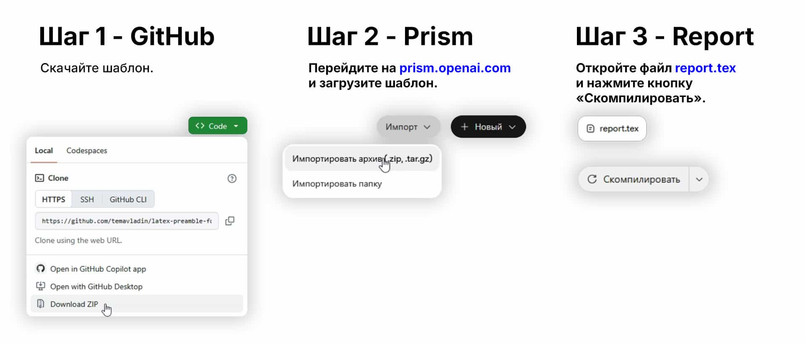

# LaTeX-преамбула для оформления отчетов по ГОСТ 7.32-2017

Шаблон и преамбула к компилятору XeLaTeX. Соблюдены требования ГОСТ 7.32-2017, правила оформления отчёта о научно-исследовательской работе.


# Быстрый старт



Вы можете попробовать использовать шаблон без установки программ. Для этого воспользуйтесь онлайн-редактором [prism.openai.com](https://prism.openai.com/) или [overleaf.com](https://www.overleaf.com/).

# Примеры внешнего вида страниц отчёта

В файлах `example.tex` и `example.pdf` вы можете увидеть, соответственно, примеры разметки основных структурных элементов отчёта о НИР и то, как эти элементы будут выглядеть после компиляции.


# Титульные листы


Для примера добавлен титульный лист для НИР в общем виде — `title_gost_example.tex` и четыре титульных листа для учебных отчётов университета ГУАП.

`title_guap_coursework` — титульный лист пояснительной записки к курсовой работе.

`title_guap_practice` — титульный лист для практических работ.

`title_guap_laboratory` — титульный лист для лабораторных работ с шапкой министерства.

`title_guap_laboratory_old` — обычный титульный лист для лабораторных работ без шапки министерства.

Включить любой из этих титульных листов можно командой:

```
\include{title-pages/название_файла_титульного_листа}
```

На основе разметки этих титульных листов вы можете написать титульный лист для своего учреждения. Или можете добавить любой титульный лист как PDF с помощью команды:

```
\includepdf[pages=-]{название_файла_титульного_листа}
```